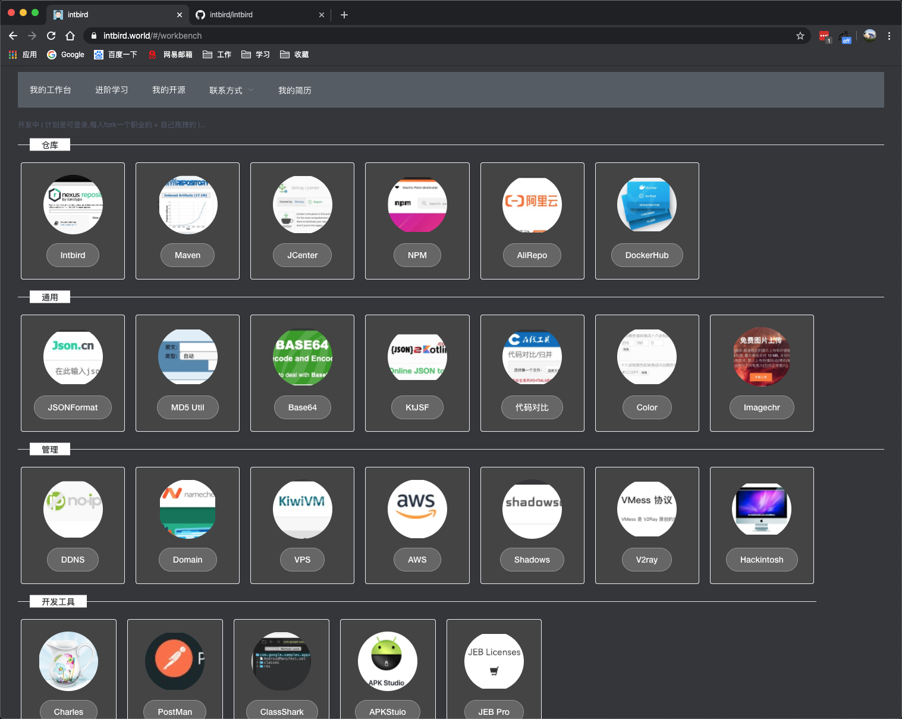
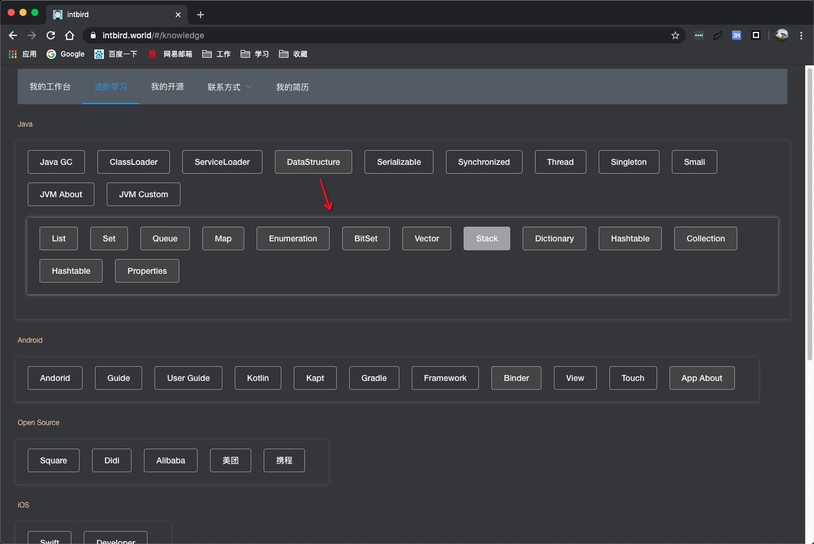
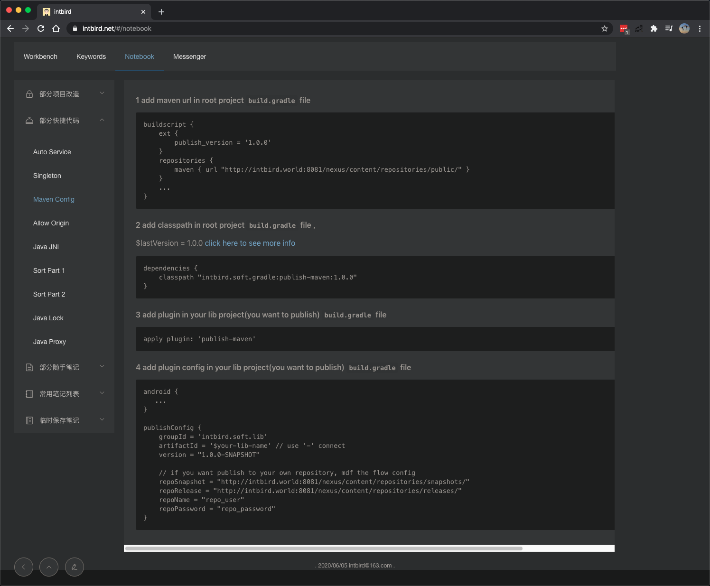

# intbird-website

`已升级为https,证书没有上传`

# Build for website: [https://intbird.world](https://intbird.world)
------
# 1. website:
 https://intbird.world/

## 2. socket url :
   https://intbird.world/#/socketio

## 3. socket server url:
   https://intbird.world:996

# 4. repo migrate:
the old repo will abandon :
 https://github.com/intbird/SocketIOControl-Server

------

# run
#### install dependencies
```
npm install
```


#### start socketio server
npm run socketio-server

#### serve with hot reload at localhost:8080
npm run dev

------

# Screenshot






